# Overview

This project explores the data job market with a primary focus on **Data Scientist** roles. I built it to better understand what employers are actually looking for and to make more informed decisions about which skills to prioritize. The analysis highlights both **high-paying** and **high-demand** skills to help identify the most valuable directions for a Data Scientist career path.

While the end goal is Data Scientist-focused (trends, pay, and optimal skills), I also compare the **top 3 most common data roles** to provide broader market context.

The dataset comes from [Luke Barousse's Python Course](https://lukebarousse.com/python) and includes job-posting data compiled by the course creator from **2023, 2024, and 2025** (job titles, salaries, locations, and listed skills).

**The full dataset is provided with the course purchase** and is not included in this GitHub repo.

Using a set of Python notebooks, I answer practical questions around skill demand, how skills change over time, salary distributions, and which skills sit at the best intersection of **pay + opportunity**.

A special thanks to [Luke Barousse](https://github.com/lukebarousse) and [Kelly Adams](https://github.com/kellyjadams) for creating the *Python for Data Analytics* course. Their structured, hands-on approach and real-world job-postings dataset made it possible to build strong Python foundations while working through an end-to-end analytics workflow (cleaning → EDA → analysis → visualization).

---

# The Questions

This project answers the following questions:

0. How do I clean and standardize the raw dataset into an analysis-ready form? (`0_Data_Preparation_and_Cleaning.ipynb`)
1. What does the dataset look like at a high level (roles, countries, platforms, companies, and basic job “opportunity” flags)? (`1_Exploratory_Data_Analysis.ipynb`)
2. What are the skills most in demand for the top 3 most popular data roles? (`2_Skill_Demand.ipynb`)
3. How are in-demand skills trending for Data Scientists over time? (`3_Skills_Trend.ipynb`)
4. How well do jobs and skills pay for Data Scientists? (`4_Salary_Analysis.ipynb`)
5. What are the optimal skills for Data Scientists to learn (high demand AND high paying)? (`5_Optimal_Skills.ipynb`)

---

# Tools & skills demonstrated

- **Python** (analysis + automation)
  - **Pandas**: data cleaning, filtering, reshaping, exploding nested skill lists, aggregations
  - **Matplotlib / Seaborn**: visualization and storytelling
- **Jupyter Notebooks**: reproducible, documented analysis workflow
- **VS Code**: project structure and iterative development
- **Git & GitHub**: version control + portfolio publishing

---

# The Analysis

## 0. Data Preparation & Cleaning

This notebook builds a reproducible preprocessing pipeline that converts the raw job-postings dataset into a clean, analysis-ready file used across all downstream notebooks.

What is done here:
- **Text standardization** for core dimensions (trim/normalize whitespace) across fields like: job title, company, locations, schedule type, country, `job_title_short`, and `job_via`.
- **Date parsing + weekly bucket:** `job_posted_date` is parsed to datetime and a **week bucket** is created (used only for repost control).
- **Posting platform cleanup:** `job_via` is normalized (e.g., removing the leading “via …” pattern).
- **Company name standardization:** basic normalization + unifying obvious variants (e.g., BeBee / Dice / Confidential).
- **Week-based deduplication (repost control):** duplicates are removed within the same week using a key built from:  
  `job_title`, `company_name`, `search_location`, `job_schedule_type`, `job_work_from_home`, and the weekly bucket.
- **Deduplicate skills within a posting:** `job_skills` is parsed from its raw CSV string format (stringified Python list) into a Python list, then repeated skills inside each posting are removed (order preserved) to prevent inflated skill counts later.
- **Export:** helper technical columns are removed and the final dataset is saved.

Output file used in all other notebooks:
- `job_postings_flat_cleaned.csv`

Note: salary cleaning/filters and skills exploding (`explode`) are handled in the **analysis notebooks** where they are needed.

View the notebook with detailed steps here: [0_Data_Preparation_and_Cleaning](0_Data_Preparation_and_Cleaning.ipynb).

---

## 1. What does the dataset look like at a high level (roles, countries, platforms, companies, and basic job “opportunity” flags)?

Before diving into skills and salary, I start with a quick EDA pass to understand the overall structure of the dataset. I look at which roles appear most often, where the jobs are located, which platforms the postings come from (after standardizing common `job_via` labels), which companies post the highest number of openings (after excluding job boards/recruiters), and what share of postings are **full-time**.

I also check three basic “opportunity” indicators to get a high-level view of how candidate-friendly the postings look on average:

- **Work from home offered** (`job_work_from_home`)
- **No degree required** (`job_no_degree_mention`)
- **Health insurance offered** (`job_health_insurance`)

Important note: `job_no_degree_mention` captures cases where the posting **explicitly states** that a degree is not required. If it’s False, it does not necessarily mean a degree is required — it may simply not be mentioned.

View the notebook with detailed steps here: [1_Exploratory_Data_Analysis](1_Exploratory_Data_Analysis.ipynb).

### Results

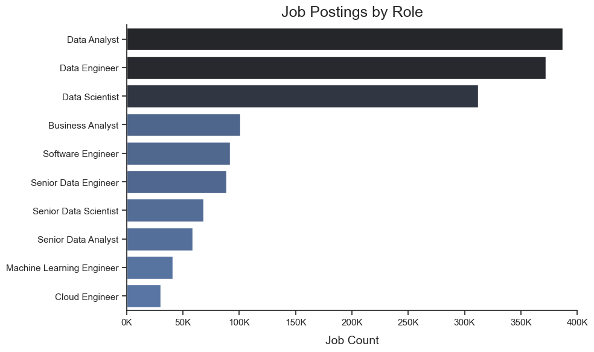

*Distribution of job postings across the most common roles.*

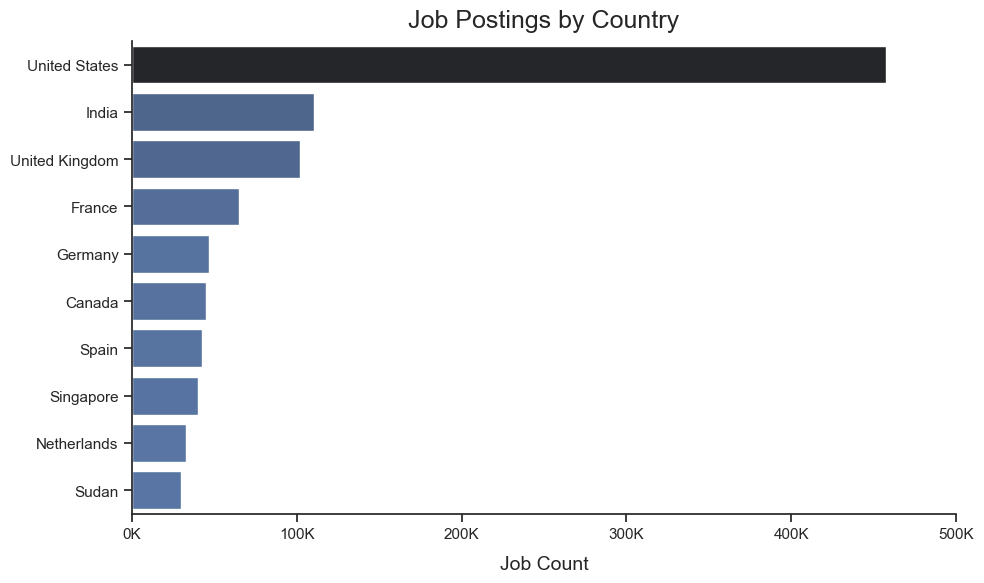

*Countries contributing the highest number of job postings.*

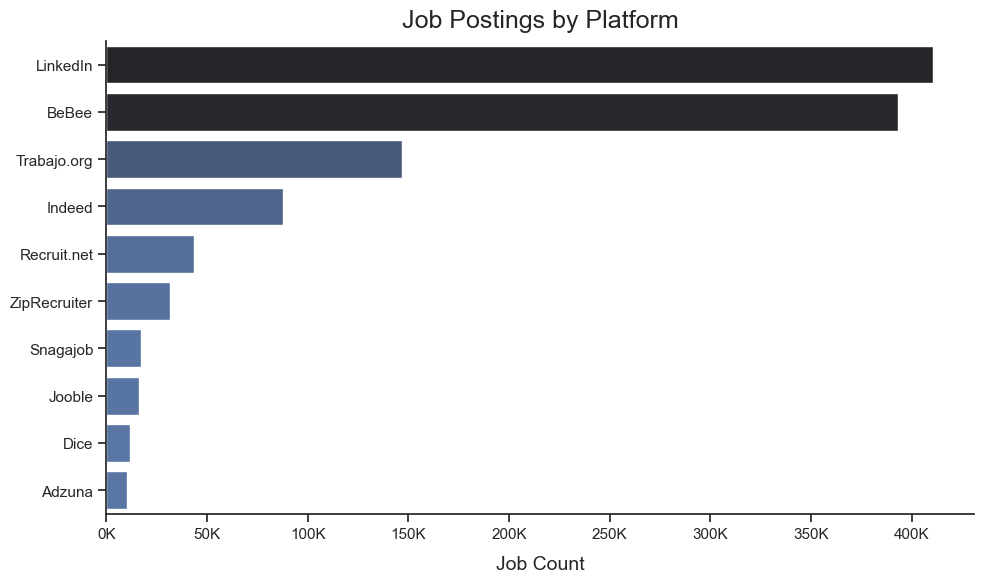

*Most common posting sources (`job_via`) after standardizing frequent platform labels (e.g., LinkedIn/Indeed/BeBee).*

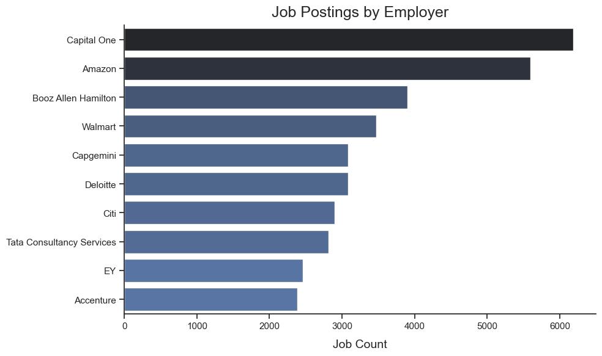

*Top employers after excluding job boards/aggregators, recruiters, and generic sources, to better reflect real hiring companies.*

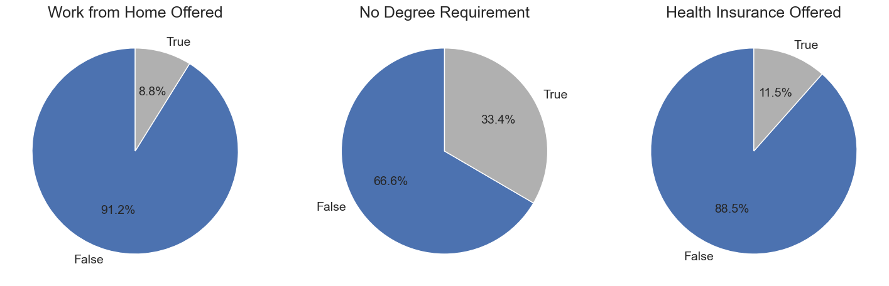

*Share of postings that mention work-from-home, explicitly state that no degree is required, and mention health insurance.*

### Insights

- **Market structure is concentrated in this dataset.** The top 3 roles dominate the dataset: **Data Analyst (24.98%)**, **Data Engineer (24.00%)**, and **Data Scientist (20.13%)**. Together they account for **69.11%** of all postings, which supports using these roles as the baseline for later skill-demand comparisons.
- **Geographic concentration is strong.** The **United States (29.51%)** is the single largest market in the dataset. Next are **India (7.14%)**, **United Kingdom (6.57%)**, and **France (4.19%)**. Together, the top 4 countries represent **47.40%** of all postings, meaning overall patterns **in this dataset** are influenced by a few major markets.
- **Posting sources are dominated by a few platforms.** The top platforms are **LinkedIn (26.47%)**, **BeBee (25.35%)**, **Trabajo.org (9.48%)**, and **Indeed (5.65%)**. Together, these top 4 account for **66.95%** of all postings. However, platform shares reflect **data sourcing/aggregation**, not employer market share.
- **Top employers skew toward large enterprises and consulting.** The top 10 employers include major finance players (**Capital One**, **Citi**), retail at scale (**Walmart**), and a strong cluster of consulting/professional services (**Deloitte**, **EY**, **Accenture**, **Capgemini**, **Tata Consultancy Services**, **Booz Allen Hamilton**), alongside large-scale recruiters (**Amazon**). This suggests the dataset’s posting volume is heavily influenced by organizations that hire continuously and across many locations—so later skill-demand results **may** partially reflect enterprise/consulting tech stacks rather than niche hiring.
- **Most postings are full-time.** **Full-time accounts for 87.24%** of all postings, so the analysis largely reflects full-time market conditions rather than contract/part-time dynamics.
- **Job opportunity flags (explicit mentions) show a conservative baseline.** Only **8.8%** of postings explicitly indicate **work-from-home** (`job_work_from_home=True`). **33.4%** explicitly state **no degree requirement** (`job_no_degree_mention=True`), while **11.5%** explicitly mention **health insurance** (`job_health_insurance=True`). These metrics reflect what employers *choose to state in the posting*—so “False” should be read as **not explicitly stated**, not necessarily “not offered/required”.

---

## 2. What are the skills most in demand for the top 3 most popular data roles?

For this question, I parse `job_skills`, keep only postings with non-empty skill lists, and explode the lists into individual rows (one row = one skill mentioned in a posting). I then group the data by role (`job_title_short`) and skill to count how often each skill appears.

To keep the analysis focused, I selected the **top 3 most common roles** and extracted the **top 5 skills** for each role by **skill likelihood (%)**. Skill likelihood is defined as:

- `skill_percent = skill_count / jobs_total_with_skills * 100`  
- where `jobs_total_with_skills` counts only postings in a given role where `job_skills` is a non-empty list (postings with missing/empty `job_skills` are excluded from the denominator)

This produces a clear, role-specific checklist of skills to prioritize.

View my notebook with detailed steps here: [2_Skill_Demand](2_Skill_Demand.ipynb).

### Results

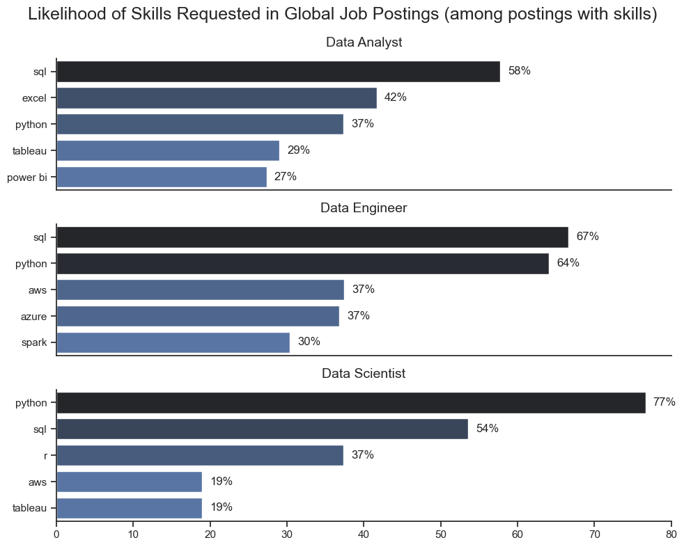

*Likelihood (%) of the top 5 skills requested for the three most common data roles (calculated among postings with captured skills).*

### Insights

- **Shared foundation across roles:** **SQL** and **Python** appear in the top skill set for all three roles, confirming they are the most transferable baseline skills.
- **Data Analyst:** demand centers on **SQL (58%)** plus productivity/BI tools — **Excel (42%)**, **Python (37%)**, **Tableau (29%)**, and **Power BI (27%)** — reflecting reporting and dashboard-heavy workflows.
- **Data Engineer:** core programming/query skills dominate (**SQL 67%**, **Python 64%**), followed by cloud and big-data tools: **AWS (37%)**, **Azure (37%)**, and **Spark (30%)**.
- **Data Scientist:** the skill profile is strongly **programming + statistical/ML-oriented**. **Python (77%)** dominates, supported by **SQL (54%)** for data access and preparation. **R (37%)** remains a common secondary language/tool, while **AWS (19%)** and **Tableau (19%)** appear less frequently, suggesting cloud and BI are mentioned more selectively than core coding skills.

---

## 3. How are in-demand skills trending for Data Scientists?

To track how skill demand changes over time, I filtered **Data Scientist** postings and derived the **posting quarter** from `job_posted_date` (covering **Q1 2023–Q4 2025**). I then kept only postings with captured skills (non-missing, non-empty `job_skills`), expanded skills into individual rows, and calculated **skill likelihood (%) per quarter** — i.e., the share of Data Scientist postings in a given quarter that mention a skill **among postings with captured skills**.

To keep the visualization readable, I selected the **top 5 skills overall across the full period** (ranked by total mentions across all quarters) and plotted their quarterly likelihood to show how consistently they appear over time.

View my notebook with detailed steps here: [3_Skills_Trend](3_Skills_Trend.ipynb).

### Results

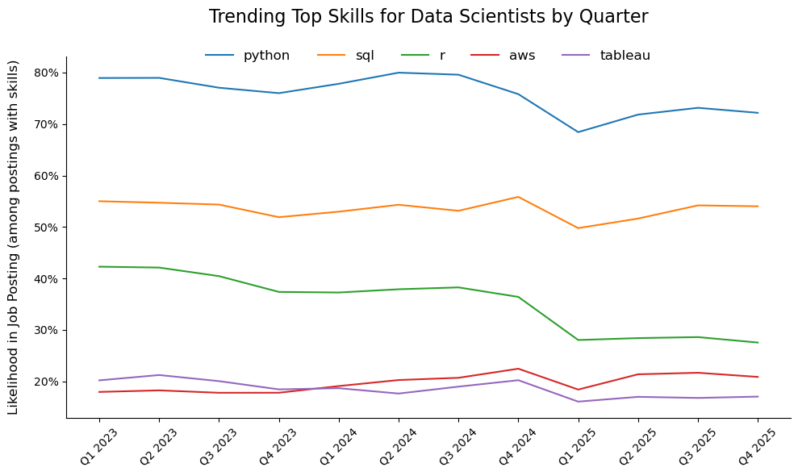  
*Line chart showing the likelihood (%) of the top 5 skills mentioned in Data Scientist postings by quarter (Q1 2023–Q4 2025), calculated among postings with captured skills.*

### Insights

- **The top 3 skills are stable across the whole period.** **Python** remains #1, **SQL** #2, and **R** #3 in every quarter.
- **Python dominates DS postings.** It appears in roughly **~69–80%** of postings with captured skills, remaining the clear #1 throughout.
- **SQL is consistently #2.** It stays in a relatively tight range of **~50–56%**, tracking Python’s pattern but at a lower level.
- **R is consistently #3, but clearly below Python/SQL.** It ranges roughly from **~28% to ~42%** and trends lower in 2025 compared with early-2023.
- **AWS and Tableau are secondary and close to each other.** Both sit mostly in the **mid-teens to low-20s** (AWS ~**18–23%**, Tableau ~**16–21%**), with small quarter-to-quarter changes.
- **A broad dip appears around Q1 2025 across all five skills.** Because it affects every skill at once, it likely reflects a **shift in posting mix or how skills are listed/captured**, not a change in demand for one specific tool.

---

## 4. How well do jobs and skills pay for Data Scientists?

To understand compensation patterns, I focused on postings with a reported `salary_year_avg`. I first compared salary distributions across the **top 6 most common roles** (within the salary-reported subset) to see how pay differs across roles and seniority. Then, I narrowed the analysis to **Data Scientist** postings with salary and captured skills, exploded `job_skills` (one row = one skill in a posting), and compared skills in two ways:

1) **Highest-paid skills** by median salary (only skills appearing in **at least 100 postings** to keep results meaningful)  
2) **Most in-demand skills within salary-reported postings** (top skills by posting count), shown with their median salary for direct comparison

View my notebook with detailed steps here: [4_Salary_Analysis](4_Salary_Analysis.ipynb).

### Salary distributions by role

#### Results

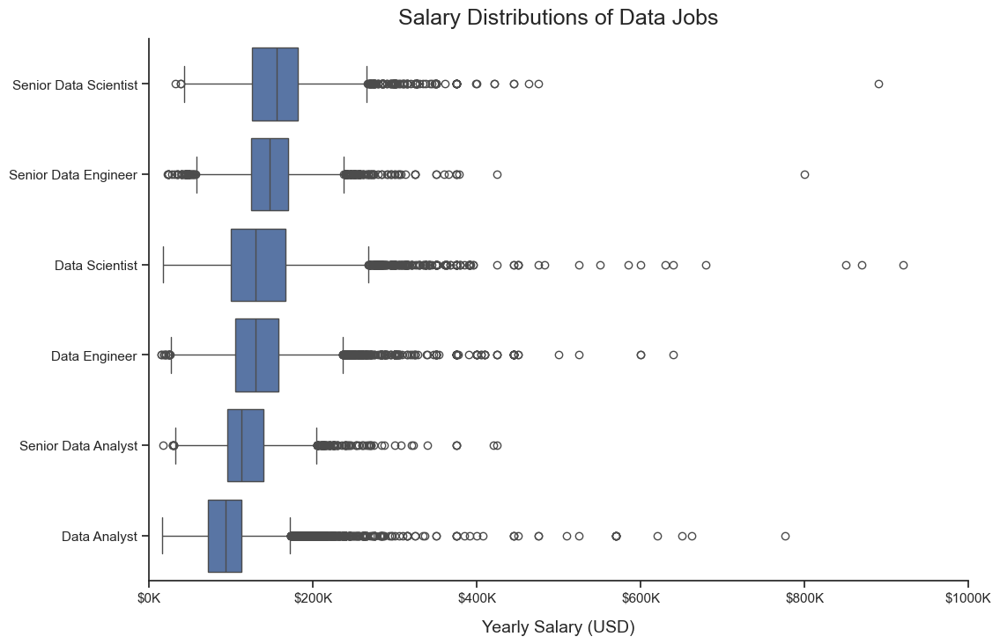  
*Box plot showing salary distributions for the top 6 most common data roles (salary-reported postings only), including outliers.*

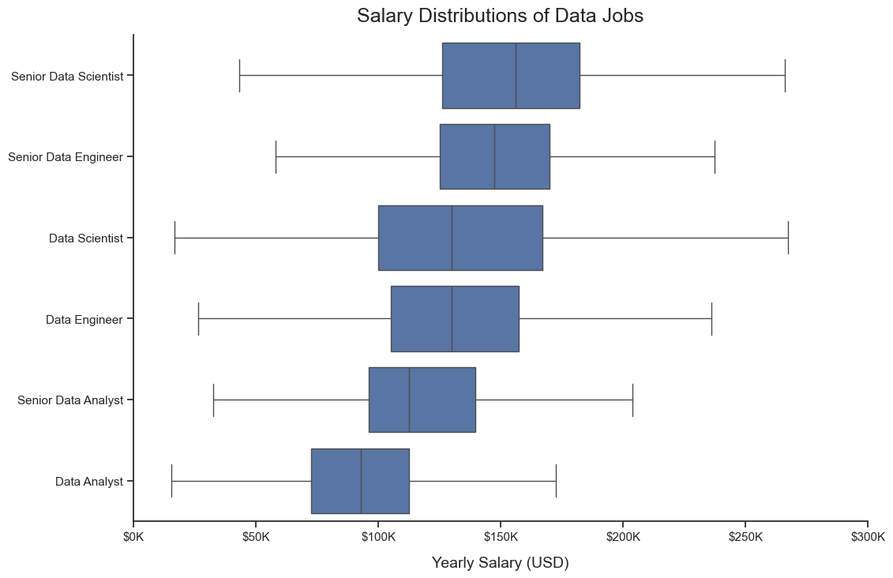  
*The same distributions with outliers hidden and the x-axis limited to better compare typical ranges.*

#### Insights

- **Salary varies substantially by role and seniority.** Senior titles show higher typical pay and wider distributions than non-senior roles.
- **Outliers strongly affect the full-range view.** Hiding outliers and limiting the axis makes cross-role “typical” ranges easier to compare.
- **Analyst roles are lower and more stable.** Data Analyst tends to have the lowest typical pay and a tighter spread, while Senior Data Analyst generally sits between analyst and DS/DE roles.

### Highest-paid vs most in-demand skills (Data Scientist)

#### Results

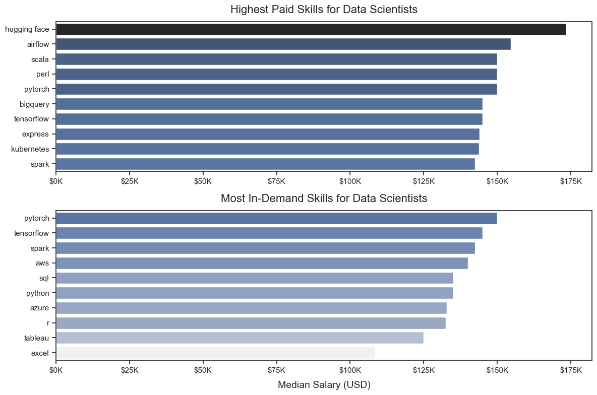  
*Two bar charts comparing (1) the highest-paid Data Scientist skills by median salary (min. 100 salary-reported postings per skill) and (2) the most in-demand skills within salary-reported postings, displayed on the same salary axis.*

#### Insights

- **Demand vs pay is not the same thing.** Core skills like **Python** and **SQL** dominate demand, while some specialized skills appear less often but are associated with higher median pay.
- **Higher-pay signal among common skills.** Within frequently requested skills, postings mentioning **PyTorch / TensorFlow / Spark** tend to show higher median salaries than more BI/reporting-oriented tools like **Tableau** or legacy analytics stacks like **SAS**.
- **Top-paying vs. most in-demand skills are closer than expected (given the ≥100 threshold).** Many “top-paying” skills that meet the minimum count threshold have median salaries that sit in a similar band to high-demand skills, suggesting that large salary jumps are more often tied to rarer niches than to core foundational tools.

---

## 5. What are the optimal skills for Data Scientists to learn (high demand AND high paying)?

To identify “optimal” skills (the best intersection of **opportunity + pay**), I focus on **Data Scientist** postings with a reported `salary_year_avg` and **captured skills** (non-missing, non-empty `job_skills`). After exploding skills (one row = one skill in a posting), I compute two metrics per skill:

- **Skill demand (%):** `skill_count / DS_job_count * 100`  
  where `DS_job_count` is the number of Data Scientist postings with **salary + captured skills**, and `skill_count` is the number of those postings that mention the skill
- **Median salary:** median `salary_year_avg` among postings that mention the skill

I visualize the trade-off using a scatter plot (**demand vs median salary**) and color points by **technology category** (programming, analyst tools, cloud, libraries, other). To keep the chart readable, I plot only skills above a demand threshold (**> 5%**).

View my notebook with detailed steps here: [5_Optimal_Skills](5_Optimal_Skills.ipynb).

### Results

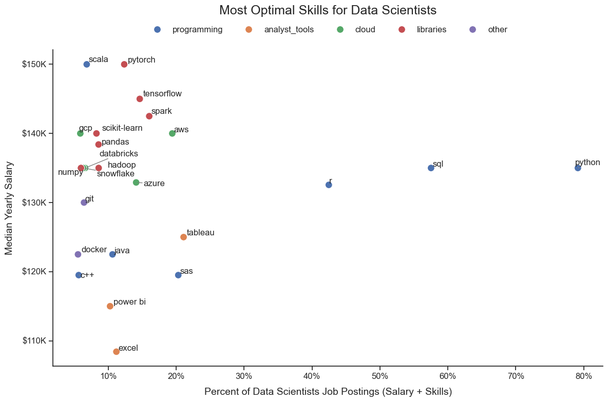  
*Scatter plot of skill demand (%) vs median salary for Data Scientist postings with salary + captured skills (skills shown: demand > 5%), colored by technology category.*

### Insights

- **Only a few skills sit in the true “high-demand + high-pay” zone.** **Python** and **SQL** combine the highest demand with strong median salary in this DS salary subset.
- **High-pay uplift often comes from ML / data-engineering ecosystem skills with mid demand.** Tools like **PyTorch**, **TensorFlow**, **Spark**, and **AWS** cluster higher on salary while appearing in a smaller share of postings than Python/SQL.
- **Cloud demand is split across vendors.** **AWS** is the most common cloud skill in this view, while **Azure** and **GCP** appear less often.
- **BI/reporting tools sit lower on the pay axis.** **Tableau** is relatively common but tends to have a lower median salary than the ML/cloud cluster; **Power BI** and **Excel** are lower still.
- **The highest median salaries tend to be niche.** Skills like **Scala** can sit at the top of the pay axis but appear in a smaller fraction of postings, making them better specialization targets than baseline priorities.

---

# What I Learned

- **Defining metrics matters.** Small choices like the denominator for “skill likelihood (%)” can materially change interpretations. I learned to validate results against data completeness (e.g., missing/empty `job_skills`) and make definitions explicit.
- **Reproducible analysis workflow.** Building the project as a notebook pipeline (clean → EDA → skill demand → trends → salary → optimal skills) helped keep the analysis consistent and easy to audit.
- **Exploding nested data at scale.** Working with list-like `job_skills` required careful reshaping (`ast.literal_eval` → filter non-empty lists → `explode`) and aggregation to produce interpretable role/skill-level insights.
- **Demand vs pay are different signals.** High-demand skills (access to jobs) and high-pay skills (compensation upside) do not perfectly overlap—“optimal” skills sit where both are reasonably strong.

---

# Key Takeaways

- **The market is dominated by a few roles.** Data Analyst, Data Engineer, and Data Scientist account for the majority of postings, making them a practical baseline for role comparisons.
- **A small set of skills is consistently transferable.** SQL and Python show up across roles and remain the strongest “foundation” skills.
- **Role focus differs clearly by toolsets.**
  - Data Analysts skew toward SQL + spreadsheet/BI tools.
  - Data Engineers emphasize SQL/Python plus cloud and big-data tooling.
  - Data Scientists center on Python/SQL with a secondary layer of statistical/ML and infrastructure tools.
- **Trends must be interpreted with data coverage and posting mix in mind.** Quarter-to-quarter skill likelihood can shift due to missingness in `job_skills` or changes in sourcing/composition, so completeness checks are essential for trustworthy conclusions.
- **“Optimal skills” require balancing opportunity and pay.** Core skills sit on the high-demand side, while specialized skills can push median salary higher but tend to be less common in postings.

---

# Challenges I Faced

- **Data completeness and metric design.** Some quarters/subsets had substantially higher missingness in `job_skills`, requiring adjustments to avoid artificial drops in skill likelihood.
- **Avoiding false precision.** Many differences are real in this dataset but can still reflect sourcing/platform effects or sample composition, so I focused on clear, defensible interpretations.
- **Visualization trade-offs.** Making charts readable while keeping them truthful (e.g., filtering to postings with captured skills, labeling strategy, outlier display choices, and thresholding in the “optimal skills” chart) required iteration.

---

# Conclusion

This project builds a practical view of the data job market (with a deeper focus on Data Scientist roles) by combining skill demand, trends, and salary signals into a single reproducible workflow. The result is a more evidence-based way to prioritize skills: start with broad fundamentals that maximize job access, then add targeted tools that shift you toward higher-paying segments of the market.

From a learning perspective, this project strengthened my core **Python-for-analytics** toolkit. I practiced end-to-end analysis in Pandas (cleaning, filtering, reshaping, exploding nested skills, and aggregations), validated results using lightweight data-quality checks, and translated findings into clear visuals. Overall, it’s a solid milestone in my Data Analyst learning path and a foundation I can reuse for future market and domain analyses.